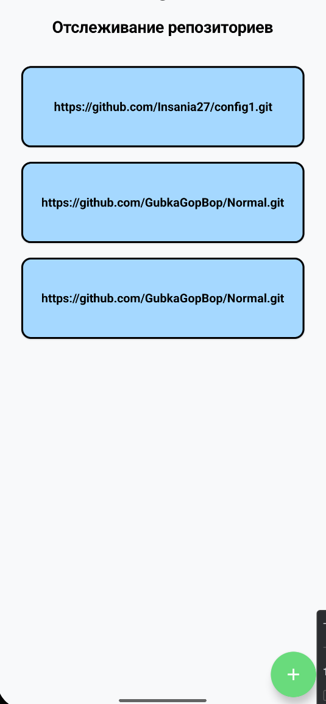
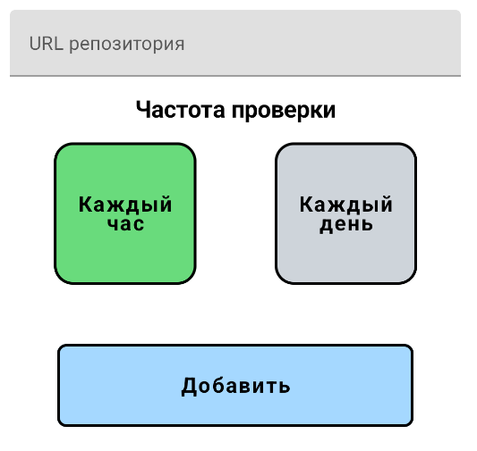
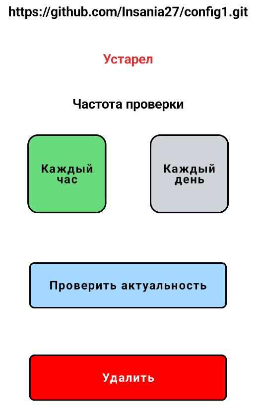

**Приложение для отслеживания актуальности локального репозитория**

На экране списка репозиториев отображаются все репозитории, которые вы добавили. 
При нажатии на плюс внизу экрана, произойдет переход на экран добавления репозитория.

На экране добавления репозитория необходимо ввести URL нужного репозитория и выбрать частоту
его проверки. После этого можно добавить репозиторий в список.

На экране деталей репозитория, отображается основная информация о нём: URL, актуальность,
выбранная частота проверки (её можно изменить). Можно проверить актуальность репозитория
в настоящий момент, также есть возможность удалить репозиторий из списка.

